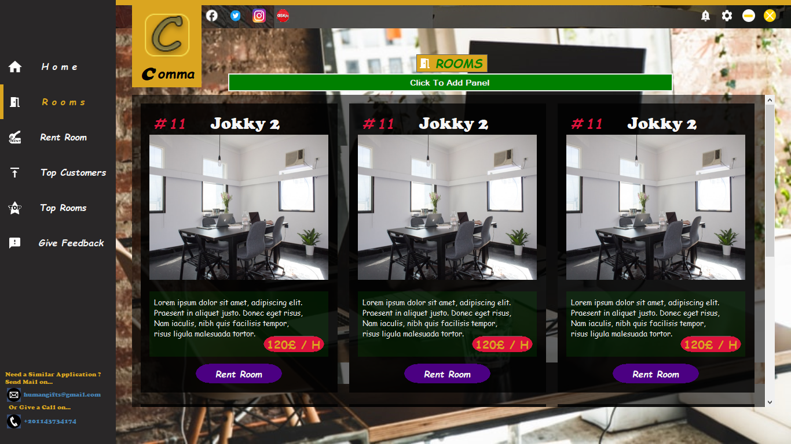

# Co-Working-Space-System
An Information System Project With Database In SQL Server

[Database SQL Script](Comma/Database/CommaSpace_Database.sql)

[Database SQL Procedures](Comma/Database/Procedures/)

  
Procedures

    
- [AddRoom](Comma/Database/Procedures/AddRoom.sql)
- [UpdateRoom](Comma/Database/Procedures/UpdateRoom.sql)

***
### Some Runtime Screenshots

