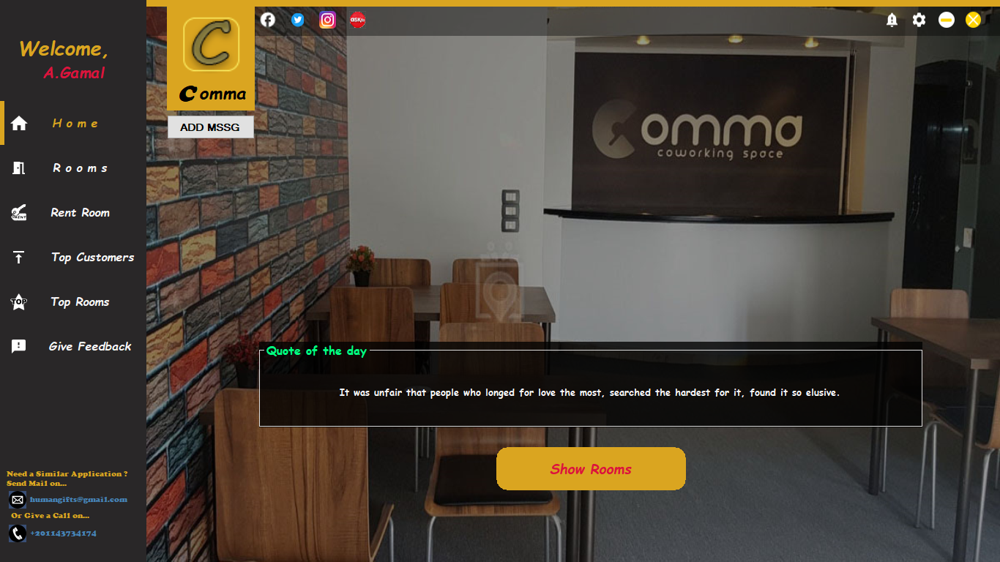
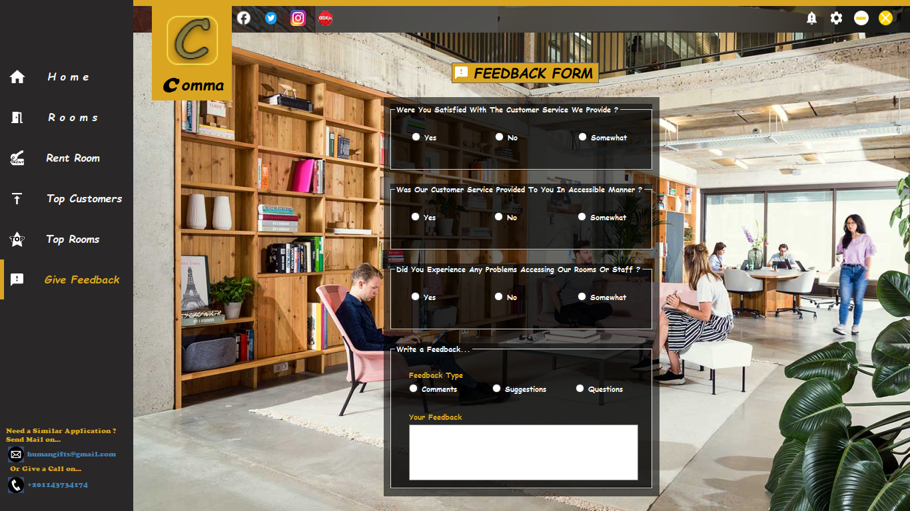
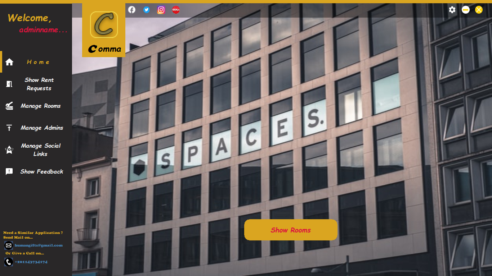
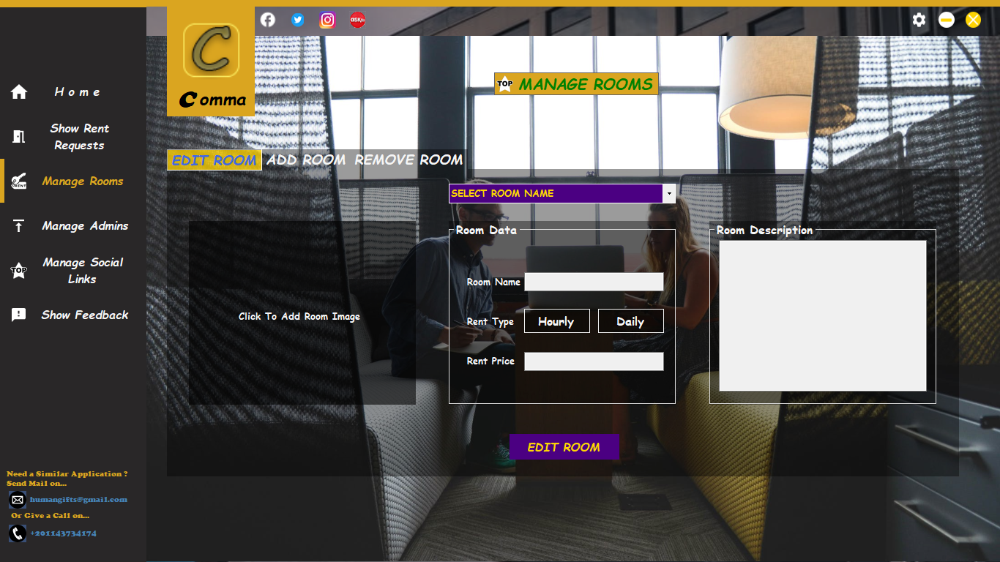

# Co-Working-Space-System
An Information System Project With Database In SQL Server.

Co-working is when people assemble in a neutral space to work independently on different projects,  
or in groups on the same projects so Co-working spaces offer the same amenities 
you would find in a traditional office and this is my programming edition for that system.

Comma Space Offers an easily communication between the customers and the space admins, 
from showing available rooms and seeing their rentals to booking the rooms, sending feedbacks and Special Messages. 

***
## Database
[Database Backup](Comma/Database/CommaSpace.bacpac)

[Database SQL Script](Comma/Database/CommaSpace_Database.sql)

[Database SQL Procedures](Comma/Database/Procedures/)

  
Procedures

    
- [AddRoom](Comma/Database/Procedures/addRoom.sql)
- [UpdateRoom](Comma/Database/Procedures/UpdateRoom.sql)
- [RemoveRoom](Comma/Database/Procedures/RemoveRoom.sql)
- [AddSocialLinks](Comma/Database/Procedures/AddSocialLinks.sql)
- [InsertIntoFeedback](Comma/Database/Procedures/InsertIntoFeedback.sql)
- [ShowFeedback](Comma/Database/Procedures/ShowFeedback.sql)
- [InsertUser](Comma/Database/Procedures/InsertUser.sql)
- [InsertReservation](Comma/Database/Procedures/InsertReservation.sql)
- [EditRentalState](Comma/Database/Procedures/EditRentalState.sql)
- [IncreaseUserRentals](Comma/Database/Procedures/IncreaseRentals.sql)
- [AddMessage](Comma/Database/Procedures/AddMessage.sql)
- [GetCustomerMessages](Comma/Database/Procedures/GetCustomerMessages.sql)
- [GetAdminMessages](Comma/Database/Procedures/GetAdminMessages.sql)
- [MakeMessageSeen](Comma/Database/Procedures/MakeMessageSeen.sql)
  

  
ER Diagram

  
  
  
  

  
Schema

  
  
  

***
### Some Runtime Screenshots

